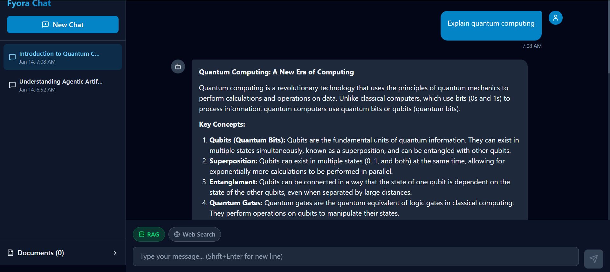
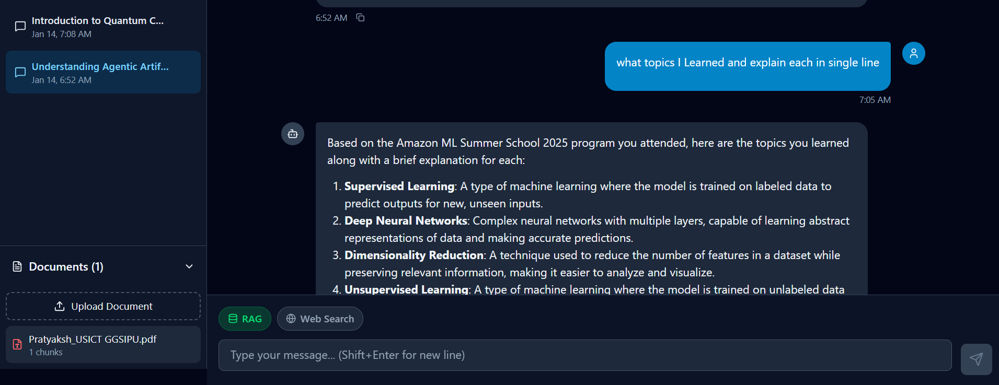
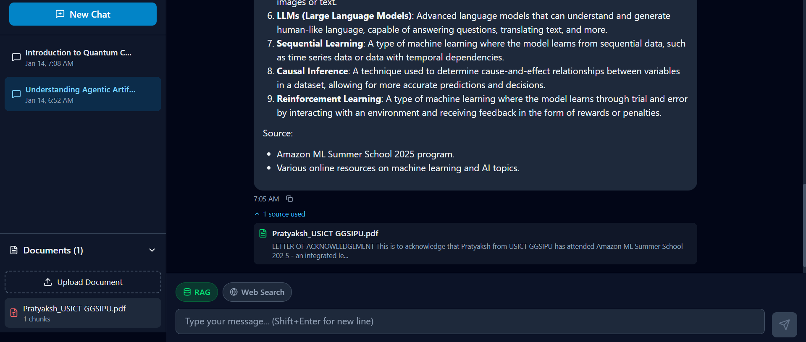

# Fyora Chat - AI Chat Application with RAG & Web Search

A production-ready conversational AI application featuring RAG (Retrieval Augmented Generation), web search integration, and real-time streaming responses.






## Features

- 🗨️ **Conversational Chat Interface** - Clean, modern UI with message history
- 📁 **Multiple Conversation Threads** - Create, switch, and manage conversations
- ⚡ **Real-time Streaming** - Token-by-token response display
- 📄 **RAG System** - Upload and query documents (PDF, DOCX, TXT, MD)
- 🌐 **Web Search** - Real-time web search integration
- 💾 **Persistent Storage** - SQLite database for conversations
- 🎨 **Modern UI** - Tailwind CSS with dark theme

## Tech Stack

### Backend
- **FastAPI** - Modern async Python web framework
- **LangChain** - LLM orchestration and RAG
- **Groq API** - Fast LLM inference (Llama 3.1)
- **ChromaDB** - Vector database for embeddings
- **SQLite** - Conversation storage
- **DuckDuckGo** - Web search

### Frontend
- **React 18** - UI library
- **Vite** - Build tool
- **Tailwind CSS** - Styling
- **Lucide React** - Icons

## Database Schema

```sql
-- Threads table
CREATE TABLE threads (
    id TEXT PRIMARY KEY,
    title TEXT DEFAULT 'New Conversation',
    created_at DATETIME DEFAULT CURRENT_TIMESTAMP,
    updated_at DATETIME DEFAULT CURRENT_TIMESTAMP
);

-- Messages table
CREATE TABLE messages (
    id TEXT PRIMARY KEY,
    thread_id TEXT REFERENCES threads(id) ON DELETE CASCADE,
    role TEXT NOT NULL,  -- 'user' or 'assistant'
    content TEXT NOT NULL,
    sources TEXT,  -- JSON array of sources
    created_at DATETIME DEFAULT CURRENT_TIMESTAMP
);

-- Documents table
CREATE TABLE documents (
    id TEXT PRIMARY KEY,
    filename TEXT NOT NULL,
    file_path TEXT NOT NULL,
    file_type TEXT NOT NULL,
    chunk_count INTEGER DEFAULT 0,
    uploaded_at DATETIME DEFAULT CURRENT_TIMESTAMP,
    processed BOOLEAN DEFAULT FALSE
);